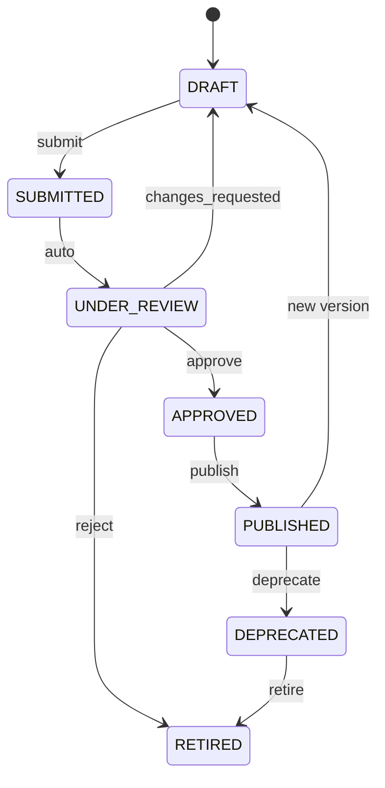
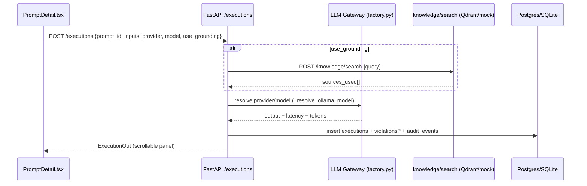
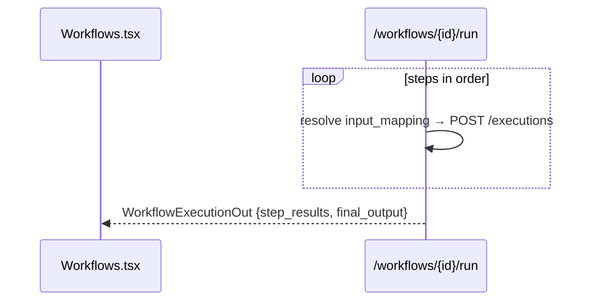
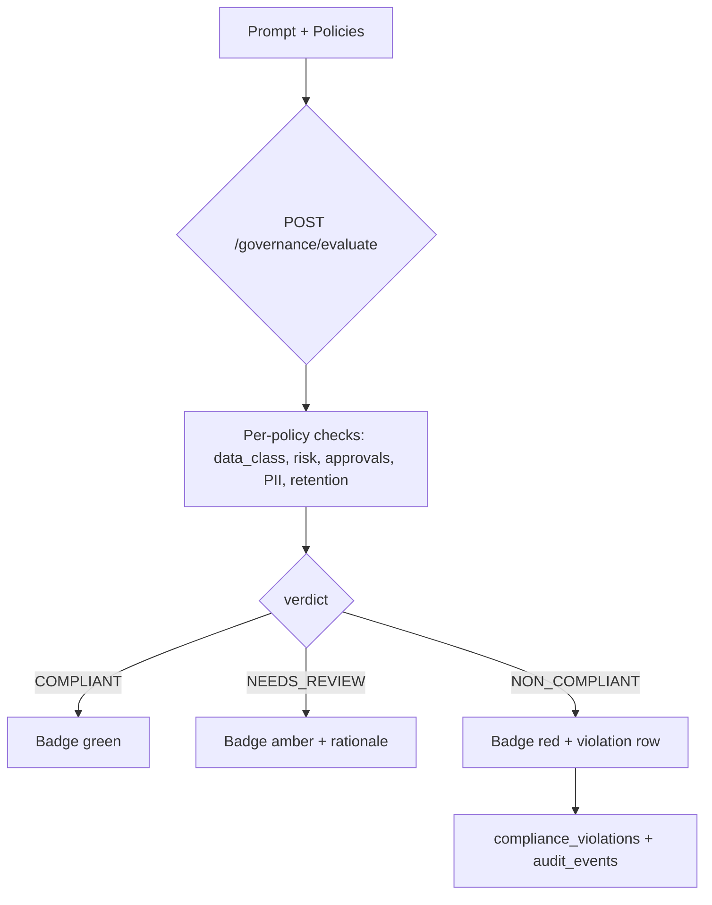
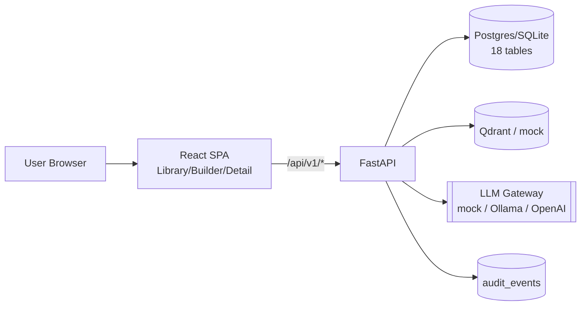
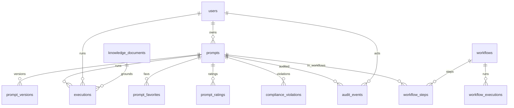

# Functional Specifications — PromptHub Enterprise

> **Version:** 1.0 — 2026-08-26
> **Status:** Draft for Review
> **Authors:** Henry + Muse Spark
> **Stack:** FastAPI + React/TS/Vite + SQLite→PG + Mock/Ollama/OpenAI

---

## Document Control

| Field | Value |
|-------|-------|
| Document ID | FSD-PH-2026-08-26-v1.0 |
| Repository | Enterprise_Prompts (main @ 0fa6efd) |
| Normative specs | product-spec.md, openapi.yaml (3058 lines), DATA_MODEL.md (18 tables) |

### Revision History

| Version | Date | Author | Change |
|---------|------|--------|--------|
| 1.0 | 2026-08-26 | Spark/Henry | Initial FSD |

### Approval Matrix

| Role | Name | Signature | Date |
|------|------|-----------|------|
| Product Owner | Henry |  |  |
| Engineering Lead |  |  |  |
| Governance / Security |  |  |  |

---

## Table of Contents

1. [Project Overview & Scope](#1-project-overview--scope)
2. [User Personas & Use Cases](#2-user-personas--use-cases)
3. [Functional Requirements](#3-functional-requirements)
4. [Workflows & Diagrams](#4-workflows--diagrams)
5. [UI Specifications](#5-ui-specifications)
6. [Data Models & Dictionary](#6-data-models--dictionary)
7. [Integrations & APIs](#7-integrations--apis)
8. [Performance Requirements](#8-performance-requirements)
9. [Security & Compliance](#9-security--compliance)
10. [Accessibility & Compatibility](#10-accessibility--compatibility)
11. [Assumptions, Constraints & Dependencies](#11-assumptions-constraints--dependencies)
12. [Acceptance Criteria & Sign-off](#12-acceptance-criteria--sign-off)

---

## 1. Project Overview & Scope

### 1.1 Executive Summary

Enterprise teams accumulate thousands of ad-hoc prompts across Outlook, Teams, Word, Excel and PowerPoint with no ownership, versioning, quality bar or governance. Failed migrations, model lock-in and un-auditable AI use create operational and compliance risk.

**PromptHub Enterprise** is a self-hosted **prompt library + engineering workbench + test harness + governance control plane**. Every prompt is classified (business function × application × task × audience × data class × risk), versioned, quality-scored (9-component 100-point engine), and executable via a single LLM gateway (mock / local Ollama / OpenAI-compatible) with deterministic evaluation and immutable audit. Ships with **Contoso M365 synthetic dataset** (68 prompts / 5 workflows / 16 docs / 8 users) for zero-deps demo.

### 1.2 Goals & Objectives

| # | Goal | Measurable Outcome |
|---|------|--------------------|
| G1 | Single governed library | 68 seeded prompts browseable, filterable, searchable, paginated |
| G2 | Engineering quality | Deterministic 0–100 score + 9 components + actionable feedback |
| G3 | Safe execution | Single `/executions` path records provider/model/latency/tokens/eval + optional grounding |
| G4 | Composable automation | 5 promptbook workflows with per-step results + final output |
| G5 | Audit & compliance | Every mutation → `audit_events`; 5 policies + violation ledger |
| G6 | Zero-deps demo | `docker compose up` or `uvicorn --port 8010 + npm run dev` yields seeded system |

### 1.3 Scope

**In scope:** Library (browse/filter/search/sort/paginate/favourite/rate), Prompt Detail (versions/attributes/executions/ratings/audit), Builder (guided composition), Assistant (analyse/improve/generate/explain), Test Execution (single + grounded RAG), Workflows (CRUD + run), Governance (posture + evaluate + scan), Analytics (overview/trend/top/category), Audit (timeline + filters), Admin (health/seed), Quality engine, LLM gateway, Seed determinism, OpenAPI contract, CI.

**Out of scope (this cohort):** SSO / external IdP, RBAC beyond `USER/AUTHOR/REVIEWER/ADMIN/GOVERNANCE`, multi-region/HA, billing, multi-tenant isolation, cloud autoscaling. Local is default; Render free-tier is documented in `Cloud_Deployment.md`.

### 1.4 Success Metrics

- Library renders < 800 ms p95 for 68 rows, server-filtered.
- Quality score recomputes < 300 ms, stable for same input.
- Execution mock p95 < 1.2 s, Ollama < 8 s with `latency_ms` recorded.
- Analytics matches seeded: `prompt_count=68, published_count=44, execution_count=320, success_rate≈0.94`.
- 23 backend + 7 frontend tests green; `ruff` clean; `npm run build` succeeds.

### 1.5 Reference Documents

`product-spec.md`, `DATA_MODEL.md`, `TECHNICAL_GUIDE.md`, `IMPLEMENTATION_GUIDE.md`, `openapi.yaml`, `USERGUIDE.md`, `TESTING.md`, `TROUBLESHOOTING.md`, `Cloud_Deployment.md`, `ops/render-free.md`, `backend/app/core/enums.py`, `backend/app/models/entities.py`, `backend/app/schemas/api.py`.

---
## 2. User Personas & Use Cases

### 2.1 Personas

| Persona | Role | Needs | Anti-needs |
|---------|------|-------|------------|
| **Priya — Author** | Business analyst / IC | Compose, test, iterate, publish; quality feedback | No policy editing |
| **Marco — Reviewer** | Domain lead | Queue `SUBMITTED/UNDER_REVIEW`, approve/reject/changes_requested | Cannot delete audit |
| **Aisha — Governance** | Risk officer | Posture dashboard, evaluate/scan, violation ledger | Cannot mutate body except via version |
| **Jon — Admin** | Platform owner | Health, seed, user catalog, analytics, audit export | Cannot bypass audit |
| **System** | RAG + Quality Engine | Deterministic scoring, retrieval, evaluation without LLM |  |

Seed users: `backend/app/seed/users_catalog.py` — 8 Contoso users, `henry` ADMIN auto-sign-in when `ENABLE_AUTH=false`.

### 2.2 Role–Permission Matrix

| Capability | AUTHOR | REVIEWER | ADMIN | GOVERNANCE | USER |
|------------|:---:|:---:|:---:|:---:|:---:|
| Library browse/search | ✓ | ✓ | ✓ | ✓ | ✓ |
| Create draft / edit own draft | ✓ | ✓ | ✓ | ✓ | — |
| Submit for review | ✓ | ✓ | ✓ | ✓ | — |
| Create new version | ✓ | ✓ | ✓ | ✓ | — |
| Approve / Reject | — | ✓ | ✓ | ✓ | — |
| Governance evaluate/scan | — | — | ✓ | ✓ | — |
| Analytics / Audit read | ✓ | ✓ | ✓ | ✓ | ✓ |
| Admin seed | — | — | ✓ | — | — |
| Favourite / Rate | ✓ | ✓ | ✓ | ✓ | ✓ |

> Frontend gates by role; backend trusts `X-User-Id` when `ENABLE_AUTH=false` (demo). Prod overlays SSO.

### 2.3 Use Cases (step-by-step)

**UC-01 — Browse & Filter (Priya)**
1. Dashboard → stats (68/44/5) + trend. 2. Library → `GET /api/v1/prompts?page=1&page_size=12&sort_by=updated_at`. 3. Filters: `business_function=Finance`, `status=PUBLISHED`, `risk=Low` → URL synced, re-fetched. 4. Search `invoice` → debounced `q=invoice` (title/body/tags). 5. Sort by `rating` → paginate; favourites/ratings persist per user.

**UC-02 — Draft → Publish (Priya + Marco)**
1. Builder → goal/context/source/expectations + `{{inputs}}` + tone/format/temperature/governance → `POST /prompts` → `DRAFT`. 2. `POST /prompts/{id}/submit` → `SUBMITTED`; `analyse` 72/100. 3. Marco: `POST /prompts/{id}/review {decision: APPROVED}` → `PUBLISHED`; `audit_events` + `prompt_versions` snapshot.

**UC-03 — Test with Grounding (Priya)**
PromptDetail → Test panel → `inputs: {invoice_id: "INV-001"}` → provider `auto`, model auto `gemma4:e2b` → `use_grounding=true` → `POST /executions` → `knowledge/search` over 16 docs → response cites `sources_used`.

**UC-04 — Workflow Run**
Workflows → "Invoice triage" (5 steps) → `POST /workflows/{id}/run {inputs}` → `WorkflowExecutionOut {step_results[], final_output}`.

**UC-05 — Governance Sweep (Aisha)**
`GET /governance/summary` → `POST /governance/evaluate {prompt_id}` → `COMPLIANT/NON_COMPLIANT/NEEDS_REVIEW` → `POST /governance/scan` → `violations[]` as `compliance_violations`.

**UC-06 — Audit Trail (Jon)**
`GET /audit?entity_ref=PROMPT-000012&limit=50` → immutable timeline of creates/updates/reviews/executions.

---
## 3. Functional Requirements

> Notation: **FR-###** — "The system **shall** …". Each FR maps to endpoint(s) + UI + test.

### 3.1 General

- **FR-001** The system **shall** expose all HTTP via `openapi.yaml` (from `GET /openapi.json`) and the frontend **shall** use only `frontend/src/api/*`.
- **FR-002** The system **shall** seed deterministically when `SEED_DEMO_DATA=true` and `prompt_count==0`: 68 prompts, 5 workflows, 5 policies, 16 docs, 8 users, ~320 executions. `POST /api/v1/admin/seed` **shall** be idempotent.
- **FR-003** The system **shall** support `LLM_PROVIDER ∈ {auto,mock,ollama,openai,azure}` with fallback `auto` → Ollama if `/api/tags` lists models → `mock`.
- **FR-004** The system **shall** expose `GET /health → {"status":"ok"}` and `GET /api/v1/analytics/overview` as liveness + seed-verify probes.

### 3.2 Library

- **FR-010** The system **shall** list prompts via `GET /prompts` with `page, page_size 1–100, q, business_function, application, task, status, risk_level, owner_id, sort_by ∈ {updated_at,rating,executions}, sort_order`.
- **FR-011** The system **shall** filter server-side and return `{items[], total, page, page_size, total_pages}`; empty → "No prompts match your filters".
- **FR-012** The system **shall** persist per-user favourites (`prompt_favorites`) and ratings 1–5 (`prompt_ratings` + comment), surfacing `avg_rating`, `favorites_count`, `execution_count`.
- **FR-013** The system **shall** support free-text search over title/body/tags/governance notes.

### 3.3 Prompt Detail & Lifecycle

- **FR-020** The system **shall** store prompts: `id PROMPT-######, title, body (≥1 {{placeholder}} or waived), business_function, application, task, audience, data_classification, risk_level, status, owner_id, tags[] JSON, governance_notes, version, created_at, updated_at`.
- **FR-021** The system **shall** enforce status transitions `DRAFT → SUBMITTED → UNDER_REVIEW → APPROVED → PUBLISHED → DEPRECATED → RETIRED` and reject illegal jumps with 422.
- **FR-022** The system **shall** version every approved mutation as `prompt_versions {version, snapshot JSON, change_notes, created_by FK}` and expose `GET /prompts/{id}/versions`.
- **FR-023** The system **shall** append `audit_events {entity_type, entity_ref, action, actor, timestamp, payload JSON}` for every create/update/submit/review/execute.
- **FR-024** The system **shall** expose `GET /prompts/{id}`, `POST /prompts`, `PATCH /prompts/{id}`, `POST /prompts/{id}/submit`, `POST /prompts/{id}/review`, `POST /prompts/{id}/favorite`, `POST /prompts/{id}/rate`.

### 3.4 Builder

- **FR-030** The system **shall** provide guided builder: goal, context, source, expectations, extracted `{{inputs}}`, tone `professional|casual|formal|friendly`, output_format `text|json|markdown|table`, `temperature 0–2`, `max_tokens`, governance flags `requires_approval, data_classification, risk_level`.
- **FR-031** The system **shall** validate body contains placeholders unless waived and surface inline errors before submit.

### 3.5 Assistant (Deterministic, No LLM Required)

- **FR-040** The system **shall** expose `POST /assistant/analyse → {score 0–100, components[9], strengths[], improvements[], overall_feedback}` — deterministic, stable.
- **FR-041** The system **shall** expose `POST /assistant/improve → {improved_body, changes[]}`, `POST /assistant/generate → {generated_body}`, `POST /assistant/explain → {explanation}`.
- **FR-042** 9 components **shall** be: clarity, specificity, context, instruction_following, grounding_potential, safety, structure, tone_consistency, reusability (weights sum 100) — `backend/app/quality/engine.py`.

### 3.6 Testing / Execution

- **FR-050** The system **shall** execute via `POST /executions {prompt_id, inputs, provider, model_name, use_grounding}` → `ExecutionOut {id, output, provider, model, latency_ms, tokens_in/out, eval{instruction,grounding,overall}}`.
- **FR-051** The system **shall** auto-discover Ollama model via `GET http://ollama:11434/api/tags` preferring `gemma4:e2b` (`_resolve_ollama_model()` in `factory.py:30`), falling back to `qwen3:1.7b` then `mock`.
- **FR-052** When `use_grounding=true`, the system **shall** call `knowledge/search` (Qdrant or in-memory mock), inject top-k context, return `sources_used[]`.
- **FR-053** Executions with `record_violations != false` **shall** create `compliance_violations` when governance checks fail.
- **FR-054** Test output panel **shall** be scrollable `max-h-[55vh] overflow-auto overscroll-contain` with sticky header and `provider/model · latency · tokens` meta (`PromptDetail.tsx:328`).

### 3.7 Workflows (Promptbooks)

- **FR-060** The system **shall** CRUD workflows: `GET /workflows`, `POST /workflows`, `GET /workflows/{id}`, `PUT /workflows/{id}`, `DELETE /workflows/{id}` with `steps[] {prompt_id, order, input_mapping}`.
- **FR-061** The system **shall** run workflows: `POST /workflows/{id}/run {inputs}` → `WorkflowExecutionOut {id, status, step_results[{step, prompt_id, output, latency_ms}], final_output}`.
- **FR-062** Workflow executions **shall** be audited and listed via `GET /workflows/{id}/executions`.

### 3.8 Governance

- **FR-070** The system **shall** expose `GET /governance/summary → {high_risk, awaiting_approval, missing_owner, deprecated, total_policies}`.
- **FR-071** `POST /governance/evaluate {prompt_id, policy_id?}` **shall** return `decisions[] {policy_id, verdict ∈ {COMPLIANT,NON_COMPLIANT,NEEDS_REVIEW}, rationale}`.
- **FR-072** `POST /governance/scan` **shall** evaluate all/filtered prompts and return `violations[]`.
- **FR-073** Governance UI **shall** badge risk levels and show policy lineage.

### 3.9 Analytics & Audit

- **FR-080** `GET /analytics/overview → {prompt_count, published_count, workflow_count, policy_count, execution_count, success_rate, avg_rating, time_saved_hours, daily_trend[], top_prompts[], category_breakdown[]}`.
- **FR-081** `GET /audit?entity_ref&actor&action&limit&offset` **shall** return immutable time-ordered events; `GET /audit/{id}` single event.
- **FR-082** Export: `GET /import-export/export?format=json` streams full dump.

### 3.10 Import / Export & Knowledge

- **FR-090** `POST /import-export/import {prompts[], workflows[], policies[]}` bulk upsert with validation.
- **FR-091** `GET+POST /knowledge/documents`, `POST /knowledge/search {query, top_k}`, `POST /knowledge/grounded-execution` over 16 Contoso docs.

### 3.11 Search & Catalog

- **FR-100** `GET /catalog/search`, `GET /catalog/applications`, `GET /catalog/tasks` power filter dropdowns; `GET /search/prompts` unified search.

---
## 4. Workflows & Diagrams

### 4.1 Prompt Lifecycle — State Diagram



Validation in `backend/app/core/enums.py`; illegal transitions → 422.

### 4.2 Single Prompt Execution — Sequence



### 4.3 Workflow Execution — Sequence



### 4.4 Governance Evaluation — Flow



### 4.5 Data Flow — Level 0/1



### 4.6 System Context (C4 L1)

Users (Author/Reviewer/Governance/Admin) → PromptHub SPA → PromptHub API → {DB, Qdrant, LLM Gateway, Audit Log}. External: Ollama sidecar, OpenAI-compatible endpoint (optional).

---

## 5. UI Specifications

### 5.1 Global Shell

- **Layout:** Sidebar nav (Library, Builder, Assistant, Workflows, Analytics, Governance, Audit) + top header with user switcher (`henry` auto when `ENABLE_AUTH=false`) + health badge.
- **Routing:** `react-router-dom 7.18.2` — `/`, `/library`, `/prompts/:id`, `/builder`, `/assistant`, `/workflows`, `/analytics`, `/governance`, `/audit`.
- **State:** React Query for server state; URL query params source of truth for filters/pagination/sort.
- **API base:** `VITE_API_URL` build arg; runtime fallback in `frontend/src/api/client.ts` normalizes `localhost/short host/relative` → `https://prompthub-api-56ez.onrender.com/api/v1` on `*.onrender.com`.

### 5.2 Page Specifications

#### Dashboard (`Dashboard.tsx`)

| Element | Spec |
|---------|------|
| Stats cards | `prompt_count`, `published_count`, `workflow_count`, `policy_count`, `execution_count`, `success_rate` from `analytics/overview` |
| Trend chart | 14-day `daily_trend[]` line (recharts) |
| Category breakdown | Bar by `business_function` |
| Top prompts | Table `top_prompts[]` (title, executions, rating) |
| Guard | `prompts?.items` null guard; skeleton loaders |

#### Library (`Library.tsx`)

| Element | Spec |
|---------|------|
| Filters | `business_function`, `application`, `task`, `status`, `risk_level` — from `catalog/*` |
| Search | Debounced 300 ms, `q` param, clear ✕ |
| Sort | `updated_at` (desc default), `rating`, `executions` |
| Pagination | 12/page, `total_pages`, prev/next + numbered |
| Card | Title, truncated body 120 chars, badges (status/risk/app), `avg_rating ★`, `execution_count`, ♥ fav |
| Empty | "No prompts match your filters" + Clear filters CTA |
| Loading | 6 skeleton cards |

#### Prompt Detail (`PromptDetail.tsx:1–450`)

| Zone | Spec |
|------|------|
| Header | Title + status badge (color by `PromptStatus`) + version + owner avatar |
| Badges | `business_function`, `application`, `task`, `audience`, `data_classification`, `risk_level` |
| Body | Rendered prompt with `{{placeholders}}` highlighted |
| Tabs | Overview, Versions, Executions, Ratings, Audit |
| Attributes | 2-col grid: owner, created/updated, tags, governance_notes |
| Versions | `prompt_versions` table + diff viewer |
| Test panel | Inputs auto from `{{placeholders}}`, provider `auto/mock/ollama`, model dropdown (discovered `gemma4:e2b`), `use_grounding` toggle, Run → scrollable `max-h-[55vh] overflow-auto overscroll-contain` sticky header + `provider/model · {latency}ms · {tokens}` |

#### Builder (`Builder.tsx`)

Multi-step: Goal → Context → Source → Expectations → Inputs → Tone/Format/Temperature → Governance → Preview → Create. Live placeholder extraction, temp slider 0–2 step 0.1, output_format radio, `requires_approval` checkbox. Assistant shortcuts: Analyse/Improve/Generate.

#### Assistant (`Assistant.tsx`)

4 actions: Analyse (score+components), Improve (diff), Generate (new body), Explain (rationale) — all `POST /assistant/*` without LLM.

#### Workflows (`Workflows.tsx`)

List 5 seeded, detail DAG of steps, Run modal with inputs, result `step_results` accordion + `final_output`.

#### Analytics (`Analytics.tsx`)

KPI row, daily trend, category breakdown, top prompts — all from `analytics/overview`.

#### Governance (`Governance.tsx`)

Summary cards (high_risk etc.), 5 policies table, Evaluate single / Scan all, violations table with verdict badges.

#### Audit (`Audit.tsx`)

Filter by `entity_ref/actor/action`, paginated timeline, detail drawer with `payload` JSON.

---
### 5.3 Field-Level Specs

| Field | Type | Limits | Mandatory | Validation |
|-------|------|--------|-----------|------------|
| `title` | string | 3–120 chars | yes | non-empty, unique-ish warning |
| `body` | text | 20–8000 chars | yes | must contain `{{placeholder}}` unless waived |
| `business_function` | enum | — | yes | `BusinessFunction` |
| `application` | enum | — | yes | `Application` (Outlook/Teams/Word/Excel/PowerPoint) |
| `task` | enum | — | yes | `TaskType` |
| `audience` | enum | — | yes | `Audience` |
| `data_classification` | enum | — | yes | `DataClassification` |
| `risk_level` | enum | — | yes | `RiskLevel {Low,Medium,High,Critical}` |
| `tags` | string[] | ≤10, each ≤24 chars | no | lowercase, hyphenated |
| `temperature` | float | 0–2 | no | default 0.7 |
| `max_tokens` | int | 64–4096 | no | default 1024 |

### 5.4 Component Library

`Badge`, `Card`, `Skeleton`, `Pagination`, `Select`, `Slider`, `Tabs`, `Modal`, `Toast` — Tailwind CSS, `lucide-react` icons, no external UI kit.

### 5.5 States

- **Loading:** Skeleton cards / chart placeholders; no spinner flash < 200 ms.
- **Empty:** Illustration + "No prompts …" + CTA.
- **Error:** Banner `status + message`, retry CTA; Dashboard guards `prompts?.items` against undefined.

### 5.6 Responsive

Breakpoints `sm 640 / md 768 / lg 1024`; sidebar collapses to hamburger < 768; tables horizontal-scroll; test panel `max-h-[55vh]` keeps attributes visible.

---

## 6. Data Models & Dictionary

### 6.1 ERD



### 6.2 Tables (18) — DDL in `DATA_MODEL.md`

| # | Table | PK | Key Columns | Purpose |
|---|-------|----|-------------|---------|
| 1 | `users` | `id` | `email unique, role, display_name` | 8 Contoso users |
| 2 | `prompts` | `id PROMPT-######` | `title, body, business_function, application, task, audience, data_classification, risk_level, status, owner_id FK, tags JSON, governance_notes, version, created_at, updated_at` | Core library |
| 3 | `prompt_versions` | `(prompt_id, version)` | `snapshot JSON, change_notes, created_by FK` | Version history |
| 4 | `prompt_favorites` | `(prompt_id, user_id)` |  | Per-user favs |
| 5 | `prompt_ratings` | `(prompt_id, user_id)` | `rating 1–5, comment` | Ratings |
| 6 | `executions` | `id EXEC-######` | `prompt_id FK, user_id FK, inputs JSON, output, provider, model, latency_ms, tokens_in/out, eval JSON, sources_used JSON` | Test runs |
| 7 | `workflows` | `id WF-######` | `name, description, owner_id FK` | Promptbooks |
| 8 | `workflow_steps` | `(workflow_id, order)` | `prompt_id FK, input_mapping JSON` | DAG steps |
| 9 | `workflow_executions` | `id WFE-######` | `workflow_id FK, status, step_results JSON, final_output` | Workflow runs |
| 10 | `policies` | `id POL-######` | `name, description, rule JSON, severity` | 5 policies |
| 11 | `compliance_violations` | `id` | `prompt_id FK, policy_id FK, verdict, rationale` | Scan results |
| 12 | `knowledge_documents` | `id DOC-######` | `title, body, application, tags, embedding?` | 16 M365 docs |
| 13 | `audit_events` | `id` | `entity_type, entity_ref, action, actor FK, timestamp, payload JSON` | Immutable audit |
| 14 | `analytics_snapshots` | `id` | `date, metrics JSON` | Optional cache |
| 15–18 | `alembic_version`, joins, `import_jobs` |  |  | Infra |

### 6.3 Enumerations (`backend/app/core/enums.py`)

- `Role: USER, AUTHOR, REVIEWER, ADMIN, GOVERNANCE`
- `PromptStatus: DRAFT, SUBMITTED, UNDER_REVIEW, APPROVED, PUBLISHED, DEPRECATED, RETIRED`
- `BusinessFunction: Finance, HR, Legal, Marketing, Sales, Operations, IT, Product`
- `Application: Outlook, Teams, Word, Excel, PowerPoint`
- `TaskType: Summarize, Draft, Classify, Extract, Translate, Rewrite, Analyze, Generate`
- `Audience: Internal, External, Leadership, Customer`
- `DataClassification: Public, Internal, Confidential, Restricted`
- `RiskLevel: Low, Medium, High, Critical`
- `LLMProvider: auto, mock, ollama, openai, azure`

### 6.4 IDs

Deterministic `PROMPT-000001`…`PROMPT-000068`, `WF-00001`…, `EXEC-######` (uuid short), stable across re-seeds.

### 6.5 Indexes

`prompts(owner_id, status, business_function)`, `prompts(updated_at)`, `executions(prompt_id, created_at)`, `audit_events(entity_ref, timestamp)`, `knowledge_documents` FTS on title/body.

### 6.6 Seed Data

`backend/app/seed/` — `prompts_catalog.py` (68), `workflows_catalog.py` (5), `policies_catalog.py` (5), `knowledge_catalog.py` (16), `users_catalog.py` (8). Guard `if prompt_count==0`.

---
## 7. Integrations & APIs

### 7.1 Conventions

- Base: `/api/v1` (frontend `VITE_API_URL`).
- Auth (demo): `X-User-Id` header; `ENABLE_AUTH=false` auto `henry` (ADMIN). Prod: JWT/Entra (out of scope).
- Pagination: `page, page_size, total, total_pages`.
- Errors: `{detail: string}` with 400/401/403/404/422/500.
- CORS: `backend/app/config.py:48` default `http://localhost:5173,http://localhost:4173,http://127.0.0.1:5173,http://127.0.0.1:4173,https://prompthub-web.onrender.com` + `CORS_ORIGINS` env.
- Contract: `openapi.yaml` generated from FastAPI, drift-checked in `ci.yml`.

### 7.2 Endpoint Catalog (40+)

| Group | Method | Path | Purpose |
|-------|--------|------|---------|
| Health | GET | `/health` | liveness |
| Health | GET | `/api/v1/health` | alias |
| Analytics | GET | `/api/v1/analytics/overview` | KPI + trend |
| Prompts | GET | `/api/v1/prompts` | list+filter+search |
| Prompts | POST | `/api/v1/prompts` | create |
| Prompts | GET | `/api/v1/prompts/{id}` | detail |
| Prompts | PATCH | `/api/v1/prompts/{id}` | update |
| Prompts | POST | `/api/v1/prompts/{id}/submit` | submit |
| Prompts | POST | `/api/v1/prompts/{id}/review` | approve/reject |
| Prompts | GET | `/api/v1/prompts/{id}/versions` | versions |
| Prompts | POST | `/api/v1/prompts/{id}/favorite` | toggle fav |
| Prompts | POST | `/api/v1/prompts/{id}/rate` | rate 1–5 |
| Executions | POST | `/api/v1/executions` | run prompt |
| Executions | GET | `/api/v1/executions` | list |
| Executions | GET | `/api/v1/executions/{id}` | detail |
| Assistant | POST | `/api/v1/assistant/analyse` | score |
| Assistant | POST | `/api/v1/assistant/improve` | improve |
| Assistant | POST | `/api/v1/assistant/generate` | generate |
| Assistant | POST | `/api/v1/assistant/explain` | explain |
| Workflows | GET/POST | `/api/v1/workflows` | list/create |
| Workflows | GET/PUT/DELETE | `/api/v1/workflows/{id}` | crud |
| Workflows | POST | `/api/v1/workflows/{id}/run` | execute |
| Workflows | GET | `/api/v1/workflows/{id}/executions` | runs |
| Governance | GET | `/api/v1/governance/summary` | posture |
| Governance | POST | `/api/v1/governance/evaluate` | evaluate |
| Governance | POST | `/api/v1/governance/scan` | scan all |
| Audit | GET | `/api/v1/audit` | timeline |
| Audit | GET | `/api/v1/audit/{id}` | event |
| Knowledge | GET/POST | `/api/v1/knowledge/documents` | docs |
| Knowledge | POST | `/api/v1/knowledge/search` | RAG search |
| Knowledge | POST | `/api/v1/knowledge/grounded-execution` | grounded run |
| Catalog | GET | `/api/v1/catalog/search` | catalog |
| Catalog | GET | `/api/v1/catalog/applications` | apps |
| Catalog | GET | `/api/v1/catalog/tasks` | tasks |
| Search | GET | `/api/v1/search/prompts` | unified search |
| Import/Export | GET | `/api/v1/import-export/export` | dump |
| Import/Export | POST | `/api/v1/import-export/import` | bulk import |
| Admin | POST | `/api/v1/admin/seed` | idempotent seed |
| Admin | GET | `/api/v1/admin/users` | user catalog |

### 7.3 Schemas (`backend/app/schemas/api.py`)

`PromptCreate/Update/Out`, `PaginatedPrompts`, `ExecutionRequest {prompt_id, inputs, provider, model_name, use_grounding, record_violations}`, `ExecutionOut`, `AssistantRequest/Response`, `WorkflowCreate/Out`, `WorkflowExecutionOut`, `GovernanceEvaluateRequest/Response`, `AuditEventOut`, `AnalyticsOverview`.

### 7.4 External Integrations

| System | Mode | Config |
|--------|------|--------|
| **Ollama** | Local LLM | `OLLAMA_BASE_URL=http://ollama:11434` (compose) / `http://localhost:11434` (local); `_resolve_ollama_model()` lists `/api/tags` |
| **OpenAI-compatible** | Cloud LLM | `OPENAI_API_KEY`, `OPENAI_BASE_URL` (optional) |
| **Qdrant** | Vector store | `QDRANT_URL=http://qdrant:6333`; mock in-memory fallback |
| **PostgreSQL** | Prod DB | `DATABASE_URL=postgresql+psycopg://...` (Render `fromDatabase`); fallback `sqlite:///./prompthub.db` |

### 7.5 Import/Export

JSON dump includes `prompts[]` + `workflows[]` + `policies[]` with IDs preserved; import validates enums and upserts by `id`.

---

## 8. Performance Requirements

| Area | Requirement | Verification |
|------|-------------|--------------|
| Library list (68 rows) | p95 < 800 ms, server-filtered | k6 / Network |
| Prompt detail | < 500 ms | — |
| Assistant analyse | < 300 ms, deterministic | unit test: same input → same score |
| Execution mock | p95 < 1.2 s | `executions.latency_ms` |
| Execution Ollama (gemma4:e2b) | p95 < 8 s | — |
| Analytics overview | < 600 ms | — |
| Build | `npm run build` < 60 s | CI |
| Seed (first boot) | < 4 s for 68+5+5+16 | `docker compose logs backend` |

Cold start (Render free): backend 30–50 s wake; documented `TROUBLESHOOTING.md §11`.

---

## 9. Security & Compliance

| Control | Spec | Location |
|---------|------|----------|
| **No secrets in repo** | `.env` ignored; `.env.example` only; `git diff` pre-commit | `security/`, `.gitignore` |
| **CORS allowlist** | Default includes `localhost:*` + `prompthub-web.onrender.com`; override `CORS_ORIGINS`; preflight | `backend/app/config.py:48` |
| **Auth toggle** | `ENABLE_AUTH=false` auto `henry`; `true` enforces `X-User-Id`/JWT | `backend/app/core/auth.py` |
| **Audit immutability** | `audit_events` append-only; no DELETE/UPDATE | `backend/app/models/entities.py` |
| **Input validation** | Pydantic rejects unknown enums, overlong bodies, missing placeholders; 422 on illegal transition | `backend/app/schemas/api.py` |
| **Governance** | 5 policies evaluated on demand; violations stored, surfaced | `backend/app/api/governance.py` |
| **Data classification** | Every prompt carries `data_classification` + `risk_level`; high-risk flagged | `enums.py` |
| **Supply chain** | `uv.lock` + `package-lock.json` pinned; `vite 5.4.x`, `react-router 7.18.2`; `ruff/pytest/build` gates | `ci.yml` |
| **Headers** | `X-Content-Type-Options: nosniff`, `X-Frame-Options: DENY` | `backend/app/main.py` |

---

## 10. Accessibility & Compatibility

| Requirement | Standard | Implementation |
|-------------|----------|----------------|
| Keyboard nav | WCAG 2.1 AA | All controls Tab-reachable; modals trap focus |
| Screen reader | ARIA | Badges/buttons `aria-label`; status via text not color alone |
| Color contrast | ≥4.5:1 | Tailwind palette checked |
| Responsive | 320–1920 px | Sidebar hamburger <768; tables scroll; `max-h-[55vh]` panel |
| Browsers | Evergreen | Chrome/Edge/Firefox/Safari latest (Vite 5.4) |
| i18n | — | English only (cohort); strings stubbed in `frontend/src/i18n` |

---
## 11. Assumptions, Constraints & Dependencies

### 11.1 Assumptions

- A1: Demo runs `ENABLE_AUTH=false`; prod fronts with Entra/SSO.
- A2: Ollama optional; `mock` satisfies all journeys.
- A3: Single-region, single-instance (no HA).
- A4: Contoso synthetic data acceptable for governance demos (no real PII).

### 11.2 Constraints

- C1: Render free PG expires ~90 days and sleeps; re-seed via `POST /admin/seed` (`Cloud_Deployment.md`).
- C2: Render free backend sleeps after 15 min idle (30–50 s cold start).
- C3: `prompthub.db` stays in `.gitignore`; never committed.
- C4: PowerShell shell; `&&` invalid, `head/grep` unavailable — use `; if ($?)` + `Select-String`/`rg`.

### 11.3 Dependencies

| Dep | Version | Purpose | Fallback |
|-----|---------|---------|----------|
| Python | 3.12 | backend | — |
| FastAPI | ≥0.110 | API | — |
| SQLAlchemy | 2.x | ORM | — |
| Vite | 5.4.x | frontend build | — |
| React Router | 7.18.2 | routing | — |
| Ollama | ≥0.5 | local LLM | mock |
| Qdrant | ≥1.9 | vector search | in-memory mock |
| Docker Compose | 2.x | local topology | bare `uvicorn+npm` |

---

## 12. Acceptance Criteria & Sign-off

### 12.1 Measurable Acceptance Criteria

| ID | Criterion | Evidence |
|----|-----------|----------|
| AC-01 | `GET /health` → `{"status":"ok"}` and `GET /analytics/overview` → `prompt_count=68, published_count=44` | curl / Render health check |
| AC-02 | Library filters (function/status/risk/app), search, sort, pagination affect `total` and `items` server-side | Library UI + `GET /prompts` |
| AC-03 | Lifecycle transitions enforced; illegal → 422; every mutation → `audit_events` | `pytest` (23) |
| AC-04 | `POST /assistant/analyse` deterministic: same input → same score ±0 | unit test |
| AC-05 | `POST /executions` with `use_grounding=true` → `sources_used[]` over 16 docs | PromptDetail panel |
| AC-06 | `POST /workflows/{id}/run` → `step_results[]` + `final_output` for 5 workflows | Workflows UI |
| AC-07 | `GET /governance/summary` + `POST /governance/evaluate` + `/scan` → `decisions/violations` (5 policies) | Governance UI |
| AC-08 | `GET /audit?entity_ref=PROMPT-000001` shows immutable timeline | Audit UI |
| AC-09 | `openapi.yaml` matches `GET /openapi.json`; `frontend/src/api/*` typed | `ci.yml` drift check |
| AC-10 | `ruff` clean, `pytest -q` 23 passed, `npm run build` succeeds, `npm test` 7 passed | CI logs |
| AC-11 | `docker compose up --build` boots seeded system on `:8010`/`:5173` without keys | local smoke |
| AC-12 | Render: `prompthub-api` seeded + `prompthub-web` renders Dashboard/Library with real counts (no CORS block) | `Cloud_Deployment.md` live URLs |

### 12.2 Test Plan Mapping

| Layer | Suite | Location | Count | Gates |
|-------|-------|----------|-------|-------|
| Backend unit | quality engine, models, auth | `backend/tests/unit` | 15 | `pytest` |
| Backend integration | prompts lifecycle, executions, governance | `backend/tests/integration` | 8 | `pytest` |
| Frontend unit | API client, format utils | `frontend/src/__tests__` | 7 | `vitest` |
| Contract | openapi drift | `ci.yml` job `openapi-diff` | 1 | `diff openapi.yaml` |
| E2E (manual) | Library→Detail→Execute→Governance→Audit | `WALKTHROUGH.md` + `DEMO.md` | — | human |

### 12.3 Sign-off

| Criterion | Owner | Status | Date |
|-----------|-------|--------|------|
| FSD approved | Henry | ☐ Approved / ☐ Changes requested |  |
| Build green (`ruff`/`pytest`/`build`) | Engineering | ☐ |  |
| Live demo verified (Render URLs) | Henry | ☐ |  |
| Docs complete (`Cloud_Deployment.md`, `TROUBLESHOOTING.md §11`) | Engineering | ☑ Done | 2026-08-26 |
| Security review (`security/` + `ops/`) | Governance | ☐ |  |

> **Next steps after sign-off:** Tag `v1.0-fsd`, freeze `openapi.yaml`, open tickets per FR, schedule demo (`DEMO.md`).

---

## Appendices

### A. File Map (key sources)

```
backend/app/main.py                 lifespan + CORS + seed
backend/app/config.py:48            cors_origins allowlist
backend/app/core/enums.py           all enums + status transitions
backend/app/models/entities.py      18 tables
backend/app/schemas/api.py          Pydantic contracts
backend/app/quality/engine.py       9-component scorer
backend/app/llm/factory.py:30       _resolve_ollama_model() → gemma4:e2b
backend/app/seed/__init__.py:69     prompt_count==0 guard
backend/app/api/*.py                12 routers
frontend/src/api/client.ts          API_BASE normalization + Render fallback
frontend/src/pages/*.tsx            8 pages
frontend/vite.config.ts             proxy 127.0.0.1:8010
openapi.yaml                        3058-line contract
render.yaml                         free-tier blueprint
Cloud_Deployment.md                 Render guide
```

### B. Glossary

| Term | Definition |
|------|------------|
| Prompt | Versioned template with `{{placeholders}}`, classified and governed |
| Promptbook / Workflow | Ordered chain of prompts with input mapping |
| Grounding | Injecting top-k private docs as context before LLM call |
| Quality score | 0–100 deterministic 9-component assessment |
| Posture | Governance summary: high_risk / awaiting_approval / missing_owner / deprecated |

### C. Open Questions

| # | Question | Owner | Due |
|---|----------|-------|-----|
| Q1 | Real SSO provider for prod (Entra vs Auth0)? | Henry | — |
| Q2 | Retention for `compliance_violations`? | Governance | — |
| Q3 | Qdrant vs pgvector for prod vector store? | Engineering | — |

---

*End of Functional Specifications — PromptHub Enterprise v1.0*
